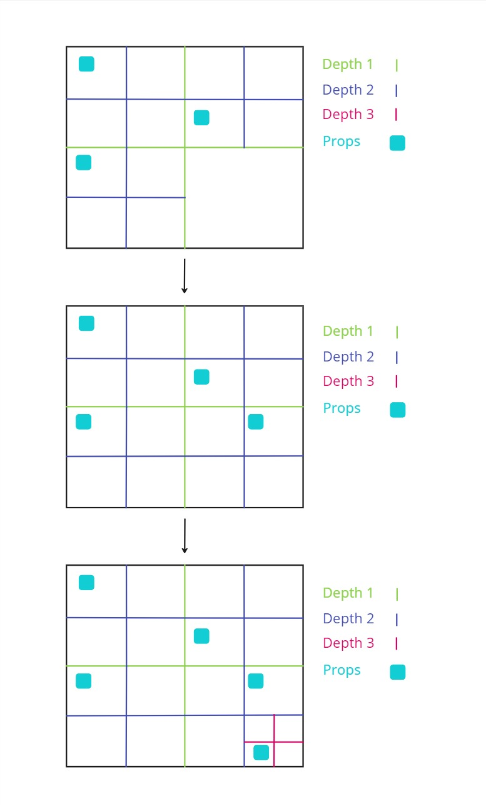
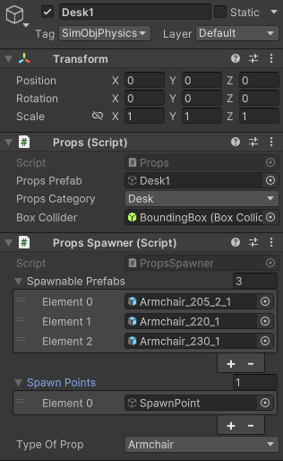
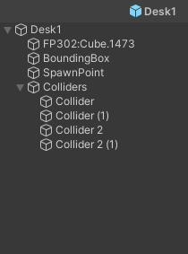

# Props placement

## Quad tree

The props are placed in the room using a quad tree : the space is divided into four equal nodes, which represent rectangles in the room. The props are placed one by one randomly in one of the biggest empty nodes, namely the empty nodes with the lowest depth. The node chosen is then divided into four nodes once again. The process is repeated until all the props are placed inside the room. This ensures that the props have the highest chance of being placed without overlapping with other props, thus limiting the number of tries needed to place them.

<p align="center">
  
  <br>
  <em>Figure: 3 steps of the quad tree division process for prop placement.</em>
</p>

## Optimal nodes

For certain types of furnitures, the node choice is not fully random and follow some rules. This allows to place the furniture in a more realistic way. Thus, to generate other kind of rooms, you would have to add new types of furniture and new sets of rules. 

Cuurently there are 2 main rules : 
- **Beds** : They are more likely to be placed in nodes close to the walls, and is aligned with the wall.
- **Fridges and sofa** : They are more likely to be placed in nodes close to the walls, and oriented with their back against the wall.

They are implemented in the ```QuadTreeNode.cs``` script.

## Spawner props

Some props place other props around them when they are instantiated. This helps having a coherent placement, while still having a random aspect. The props instancianting other props are the following :

- **TV stands** : They place a random TV on top of them, with a small angle.
- **Tables** : They place a random amount of chairs around them, and make them face the table.
- **Desk** : They place a random armchair in front of them.

## Add a prop

To create a new prop prefab, the game object needs some mandatory components :
- **A mesh** : The visual representation of the prop.
- **Accurate colliders** : The colliders must be as close as possible to the mesh, to avoid overlapping with other props. They need to have ```SimObjPhysics``` as tag.
- **A box collider** : It will be used to check which nodes are containing the prop, it doesn't need to be accurate. However, it needs to be on the ```Ignore Raycast``` layer and to have the ```BoundingBox``` tag.
- **```props.cs``` script** : You need to attach this script to the prop, link the prop's perfab and the bounding box collider. You also need to set the prop's type from a list. It is located in ```Assets/Scripts/Pro-Gen/Props```.
- **```PropsSpawner.cs``` script (optional)** : If the prop is a spawner, you need to attach this script to the prop. Then, link the list of prefabs to spawn, as well as the list of spawn points' transforms, and indicate the type of the prop. It is located in ```Assets/Scripts/Pro-Gen/Props```.

<div style="text-align: center;">
  
  
  <br>
  <em>Figure: Prefab components and tree example</em>
</div>

<br>

Once the prefab is created, it needs to be added in the props list of the ```RoomGenerationData.asset``` scriptable object, located in ```Assets/Data```. 