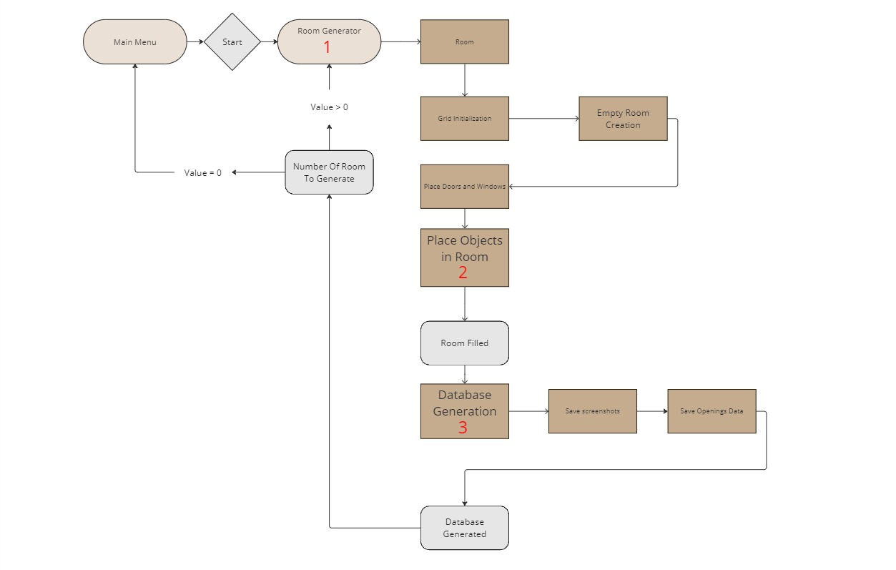

# Steps

There 3 big steps to generate synthetic data with `ISGT`:

Find details in the following sections:

1. [Room generation](room.md)
2. [Object generation](props.md)
3. [Data generation](db.md)