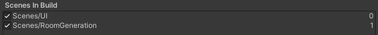

# Build

To build the project and create an executable, you only need the Unity Editor. The only constraint is that the scenes need to be numbered correctly, like in the following image.

  

Then, you can build the project by going to `File > Build Settings` and selecting the scenes in the correct order. You can then select the target platform and build the project.

Windows is the only build target that has been tested, but building for other platforms should work as well using the correct [Unity plugins](https://docs.unity3d.com/560/Documentation/Manual/PluginsForDesktop.html).

> Note that the .exe will not work if not associated with the other files created by Unity. 
